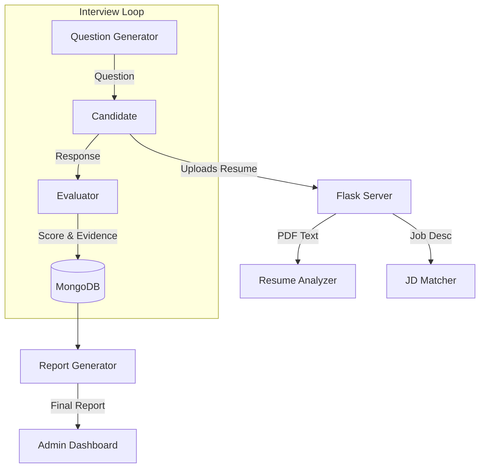

# 🤖 AI Interview Agent

A strictly autonomous, bias-free, and evidence-based AI Interviewer built with **CrewAI**, **Flask**, and **Google Gemini**.

This system replicates a human technical interview panel by using specialized AI agents to analyze resumes, match candidates to job descriptions, conduct adaptive voice/text interviews, and generate grade-specific hiring reports.

---

## 📖 Table of Contents
- [Overview](#-overview)
- [Key Features](#-key-features)
- [Tech Stack](#-tech-stack)
- [System Architecture](#-system-architecture)
- [Installation & Setup](#-installation--setup)
- [Usage Guide](#-usage-guide)
- [Project Structure](#-project-structure)
- [Contributing](#-contributing)

---

## 🚀 Overview

Traditional hiring is slow, biased, and inconsistent. The **AI Interview Agent** solves this by treating the interview process as a multi-agent workflow:
1.  **Resume Parsing**: Extracts confirmed skills (no hallucinations).
2.  **JD Matching**: Compares candidate profile against job requirements.
3.  **Active Interviewing**: Conducts a dynamic implementation interview, probing deep into claimed skills.
4.  **Strict Evaluation**: Scores responses based on *evidence* and strict criteria, preventing score inflation.

---

## ✨ Key Features

### 🧠 Multi-Agent Core (CrewAI)
-   **Resume Analyst**: Extracts factual data from PDFs.
-   **JD Matcher**: Calculates a verified match percentage.
-   **Interviewer**: Generates conversational, short, and context-aware questions.
-   **Evaluator**: Scores answers (0-10) with mandatory evidence quoting.
-   **Guardian**: strict "Jailbreak Detection" to prevent prompt injection attacks.

### 🛡️ Secure & Robust
-   **Strict Mode**: Prevents users from manipulating the AI implementation.
-   **Anti-Hallucination**: Agents are prompted to report "No Evidence" rather than guessing.
-   **Fallback Mechanisms**: Handles "I don't know" or confused responses gracefully.

### 📊 Admin Dashboard
-   Track candidate progress in real-time.
-   View detailed, evidence-backed hiring reports.
-   Analytics on pass/fail rates and skill gaps.

---

## 🛠️ Tech Stack

-   **Core**: Python 3.10+, Flask (Backend API)
-   **AI Framework**: CrewAI (Agent Orchestration), LangChain
-   **LLM Engine**: Google Gemini 1.5 Flash (via API)
-   **Database**: MongoDB Atlas (NoSQL storage for complex interview logs)
-   **Frontend**: HTML5, CSS3, Vanilla JavaScript
-   **Tools**: PyPDF2 (Parsing), Git (Versioning)

---

## 🏗️ System Architecture



---

## ⚙️ Installation & Setup

### Prerequisites
-   Python 3.10 or higher
-   MongoDB Connection URI
-   Google Gemini API Key

### 1. Clone the Repository
```bash
git clone https://github.com/Kamalesh1011/Interview-agent
cd Interview-agent
```

### 2. Create Virtual Environment
```bash
python -m venv venv
# Windows
.\venv\Scripts\activate
# Mac/Linux
source venv/bin/activate
```

### 3. Install Dependencies
```bash
pip install -r requirements.txt
```

### 4. Configuration
Create a `.env` file in the root directory (or ensure variables are set in your environment):
```ini
GOOGLE_API_KEY=your_gemini_api_key_here
MONGO_URI=your_mongodb_connection_string
SECRET_KEY=your_flask_secret_key
```

### 5. Run the Application
```bash
python app.py
```
Access the application at `http://localhost:5000`

---

## 🖥️ Usage

### For Candidates
1.  Go to the **Home Page**.
2.  Upload your **Resume (PDF)**.
3.  Paste the **Job Description** you are applying for.
4.  Click **Start Interview**.
5.  Answer the AI's questions naturally (voice or text).
6.  Receive feedback after the session.

### For Admins
1.  Navigate to `/admin/login`.
2.  Log in with admin credentials.
3.  Access the **Dashboard** to:
    -   View all interviewed candidates.
    -   Read detailed "Hire/No Hire" reports.
    -   Analyze skill breakdown per candidate.

---

## 📂 Project Structure

```
Interview-agent/
├── admin_routes.py       # Admin dashboard endpoints
├── app.py                # Main application entry point & logic
├── backend/              # RAG engine and utility scripts
├── templates/            # HTML Frontend templates
├── static/               # CSS/JS assets
├── tools/                # Helper tools for agents
├── uploads/              # Temp storage for resumes
├── requirements.txt      # Python dependencies
└── README.md             # Project documentation
```

---

## 🤝 Contributing

Contributions are welcome! Please follow these steps:
1.  Fork the repository.
2.  Create a feature branch (`git checkout -b feature/NewFeature`).
3.  Commit your changes.
4.  Push to the branch.
5.  Open a Pull Request.

---

## 📜 License

This project is licensed under the MIT License.